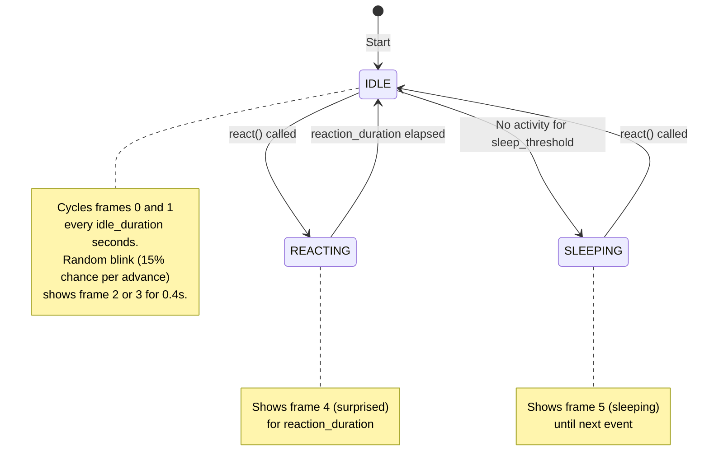
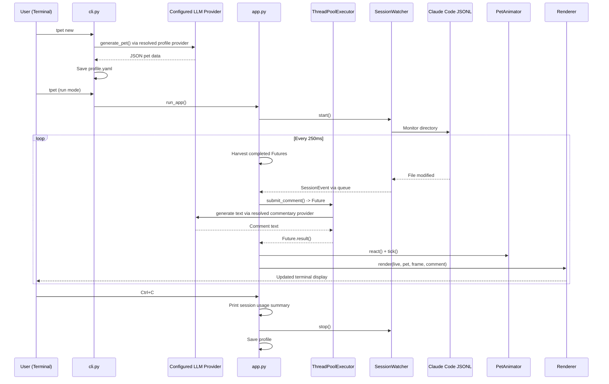
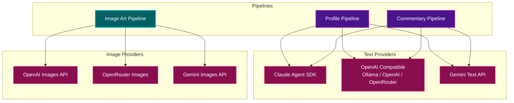

# tpet Architecture

A terminal pet companion that monitors Claude Code sessions and generates personality-driven commentary. The application runs as a persistent terminal process with animated ASCII art, speech bubbles, and AI-generated reactions to coding events.

## Table of Contents

- [Overview](#overview)
- [System Architecture](#system-architecture)
- [Module Structure](#module-structure)
  - [CLI Layer](#cli-layer)
  - [Application Loop](#application-loop)
  - [Data Models](#data-models)
  - [Configuration](#configuration)
  - [Profile Management](#profile-management)
  - [Session Monitoring](#session-monitoring)
  - [Commentary Generation](#commentary-generation)
  - [Animation Engine](#animation-engine)
  - [Renderer](#renderer)
  - [Art Pipeline](#art-pipeline)
- [Data Flow](#data-flow)
- [LLM Integration](#llm-integration)
- [File Storage](#file-storage)
- [Related Documentation](#related-documentation)

## Overview

tpet is a Python CLI application built with Typer that creates a unique AI-generated pet creature. The pet displays in the terminal using Rich Live rendering, monitors Claude Code session JSONL files (or plain text files) via watchdog, and produces in-character commentary about events using a configurable LLM provider.

**Key design decisions:**

- **Per-pipeline LLM provider configuration** -- Each pipeline (profile, commentary, image art) has an independent provider/model/API key configuration via `PipelineProviderConfig`. Supported providers: `claude` (Agent SDK), `ollama`, `openai`, `openrouter`, and `gemini`. Image art supports `openai`, `openrouter`, and `gemini` only (`ollama` and `claude` cannot generate images).
- **Non-blocking commentary via ThreadPoolExecutor** -- The main loop uses `time.sleep()` polling with Rich Live. LLM calls run in a single-worker `ThreadPoolExecutor` via `submit_comment()`/`submit_idle_chatter()`, which return `Future` objects harvested each tick. The worker threads bridge to async via `asyncio.run()`.
- **YAML persistence** -- Both config and pet profiles are stored as human-readable YAML using Pydantic serialization.
- **XDG compliance** -- Config and profile paths follow XDG base directory conventions via `xdg-base-dirs`.

## System Architecture

```mermaid
graph TB
    subgraph "CLI Entry"
        CLI[cli.py - Typer CLI]
    end

    subgraph "Core Loop"
        APP[app.py - Main Loop]
        ANIM[animation/engine.py - State Machine]
        RENDER[renderer/display.py - Rich Live]
        PROTO[renderer/protocol.py - Renderer Protocol]
    end

    subgraph "Session Monitoring"
        WATCH[monitor/watcher.py - Watchdog]
        TXTWATCH[monitor/text_watcher.py - Text File]
        PARSE[monitor/parser.py - JSONL Parser]
    end

    subgraph "LLM Integration"
        COMGEN[commentary/generator.py]
        PROMPT[commentary/prompts.py]
        PETGEN[profile/generator.py]
        LLMCLI[llm_client.py - OpenAI Compat Factory]
    end

    subgraph "Art Pipeline"
        ARTGEN[art/generator.py - Orchestration]
        ARTSTORE[art/storage.py - PNG/hblk File I/O]
        ARTPROC[art/process.py - Halfblock + Blink]
        ARTCLI[art/client.py - Gemini Client]
        OAICLI[art/openai_client.py - OpenAI Client]
        DETECT[art/detect.py - Terminal Caps]
    end

    subgraph "Data Layer"
        CONFIG[config.py - TpetConfig + PipelineProviderConfig]
        PET[models/pet.py - PetProfile]
        RARITY[models/rarity.py]
        STATS[models/stats.py]
        STORE[profile/storage.py - YAML I/O]
        IO[io.py - Shared YAML Helpers]
    end

    subgraph "External"
        SDK[Claude Agent SDK]
        OPENAI[OpenAI API]
        OLLAMA[Ollama Local LLM]
        OPENROUTER[OpenRouter API]
        GEMINI[Gemini API]
        JSONL[Claude Code JSONL Files]
        TXTFILE[Plain Text Files]
        YAML[~/.config/tpet/]
        ARTFILES[~/.config/tpet/art/]
    end

    CLI --> APP
    CLI --> PETGEN
    CLI --> STORE
    CLI --> ARTGEN
    APP --> WATCH
    APP --> TXTWATCH
    APP --> ANIM
    APP --> PROTO
    PROTO --> RENDER
    APP --> COMGEN
    APP --> ARTSTORE
    APP --> ARTPROC
    APP --> DETECT
    WATCH --> PARSE
    PARSE --> |SessionEvent| APP
    TXTWATCH --> |SessionEvent| APP
    COMGEN --> PROMPT
    COMGEN --> SDK
    COMGEN --> LLMCLI
    PETGEN --> SDK
    PETGEN --> LLMCLI
    ARTGEN --> ARTCLI
    ARTGEN --> OAICLI
    ARTGEN --> ARTPROC
    ARTGEN --> ARTSTORE
    ARTCLI --> GEMINI
    OAICLI --> OPENAI
    ARTSTORE --> ARTFILES
    WATCH --> JSONL
    TXTWATCH --> TXTFILE
    STORE --> YAML
    CONFIG --> YAML
    IO --> YAML
    PETGEN --> RARITY
    PETGEN --> STATS
    PET --> RARITY
    LLMCLI --> OPENAI
    LLMCLI --> OLLAMA
    LLMCLI --> OPENROUTER

    style CLI fill:#e65100,stroke:#ff9800,stroke-width:3px,color:#ffffff
    style APP fill:#e65100,stroke:#ff9800,stroke-width:3px,color:#ffffff
    style ANIM fill:#0d47a1,stroke:#2196f3,stroke-width:2px,color:#ffffff
    style RENDER fill:#0d47a1,stroke:#2196f3,stroke-width:2px,color:#ffffff
    style PROTO fill:#0d47a1,stroke:#2196f3,stroke-width:2px,color:#ffffff
    style WATCH fill:#1b5e20,stroke:#4caf50,stroke-width:2px,color:#ffffff
    style TXTWATCH fill:#1b5e20,stroke:#4caf50,stroke-width:2px,color:#ffffff
    style PARSE fill:#1b5e20,stroke:#4caf50,stroke-width:2px,color:#ffffff
    style COMGEN fill:#4a148c,stroke:#9c27b0,stroke-width:2px,color:#ffffff
    style PROMPT fill:#4a148c,stroke:#9c27b0,stroke-width:2px,color:#ffffff
    style PETGEN fill:#4a148c,stroke:#9c27b0,stroke-width:2px,color:#ffffff
    style LLMCLI fill:#4a148c,stroke:#9c27b0,stroke-width:2px,color:#ffffff
    style ARTGEN fill:#006064,stroke:#00bcd4,stroke-width:2px,color:#ffffff
    style ARTSTORE fill:#006064,stroke:#00bcd4,stroke-width:2px,color:#ffffff
    style ARTPROC fill:#006064,stroke:#00bcd4,stroke-width:2px,color:#ffffff
    style ARTCLI fill:#006064,stroke:#00bcd4,stroke-width:2px,color:#ffffff
    style OAICLI fill:#006064,stroke:#00bcd4,stroke-width:2px,color:#ffffff
    style DETECT fill:#006064,stroke:#00bcd4,stroke-width:2px,color:#ffffff
    style CONFIG fill:#37474f,stroke:#78909c,stroke-width:2px,color:#ffffff
    style PET fill:#37474f,stroke:#78909c,stroke-width:2px,color:#ffffff
    style RARITY fill:#37474f,stroke:#78909c,stroke-width:2px,color:#ffffff
    style STATS fill:#37474f,stroke:#78909c,stroke-width:2px,color:#ffffff
    style STORE fill:#37474f,stroke:#78909c,stroke-width:2px,color:#ffffff
    style IO fill:#37474f,stroke:#78909c,stroke-width:2px,color:#ffffff
    style SDK fill:#880e4f,stroke:#c2185b,stroke-width:2px,color:#ffffff
    style OPENAI fill:#880e4f,stroke:#c2185b,stroke-width:2px,color:#ffffff
    style OLLAMA fill:#880e4f,stroke:#c2185b,stroke-width:2px,color:#ffffff
    style OPENROUTER fill:#880e4f,stroke:#c2185b,stroke-width:2px,color:#ffffff
    style GEMINI fill:#880e4f,stroke:#c2185b,stroke-width:2px,color:#ffffff
    style JSONL fill:#880e4f,stroke:#c2185b,stroke-width:2px,color:#ffffff
    style TXTFILE fill:#880e4f,stroke:#c2185b,stroke-width:2px,color:#ffffff
    style YAML fill:#1a237e,stroke:#3f51b5,stroke-width:2px,color:#ffffff
    style ARTFILES fill:#1a237e,stroke:#3f51b5,stroke-width:2px,color:#ffffff
```



## Module Structure

```
src/tpet/
├── __init__.py              # Package version
├── __main__.py              # python -m tpet entry
├── cli.py                   # Typer CLI with subcommands and root callback
├── app.py                   # Main event loop (Rich Live)
├── config.py                # TpetConfig, PipelineProviderConfig, ResolvedProviderConfig, ArtMode, BubblePlacement, LLMProvider
├── llm_client.py            # Shared OpenAI-compatible client factory and text generation
├── io.py                    # Shared YAML persistence helpers for Pydantic models
├── models/
│   ├── pet.py               # PetProfile data model
│   ├── rarity.py            # Rarity enum + weighted selection
│   └── stats.py             # StatConfig + stat generation
├── profile/
│   ├── generator.py         # Pet creation via configurable LLM provider
│   └── storage.py           # YAML save/load
├── monitor/
│   ├── parser.py            # JSONL line → SessionEvent
│   ├── text_watcher.py      # Plain text file watcher (--follow)
│   └── watcher.py           # Claude Code JSONL watcher (default)
├── commentary/
│   ├── generator.py         # Comment generation via ThreadPoolExecutor + configurable LLM
│   └── prompts.py           # System/event/idle prompt builders
├── animation/
│   └── engine.py            # Animation state machine with blink support
├── art/
│   ├── generator.py         # Art generation orchestration (--gen-art / art subcommand)
│   ├── storage.py           # PNG/.hblk file I/O, sanitize_name
│   ├── client.py            # Gemini image generation client
│   ├── openai_client.py     # OpenAI image generation client
│   ├── process.py           # Image resize, half-block ANSI, chroma key removal, blink compositing
│   └── detect.py            # Terminal truecolor capability detection
└── renderer/
    ├── protocol.py          # Renderer protocol + AsciiRenderer/HalfblockRenderer implementations
    ├── display.py           # Rich Live layout builders (art + bubble)
    ├── preview.py           # Post-generation frame preview
    ├── card.py              # Full pet card (--details / details subcommand)
    └── statbars.py          # Stat bar rendering
```

### CLI Layer

`cli.py` is the Typer entry point. It provides four **subcommands** (`new`, `details`, `art`, `run`) plus a backward-compatible **root callback** that supports the same operations via flags. The root callback allows legacy usage like `tpet --new` alongside the subcommand form `tpet new`.

**Subcommands:**

1. **`new`** -- Creates a new pet via `profile/generator.py` and saves it
2. **`details`** -- Renders the full pet card and exits
3. **`art`** -- Generates graphical art frames via `art/generator.py` and exits
4. **`run`** -- Starts the main event loop in `app.py`

**Root callback flags** (backward-compatible mode):

| Flag | Short | Description |
|------|-------|-------------|
| `--new` | `-N` | Generate a new pet |
| `--details` | `-d` | Show full pet card |
| `--backstory` | `-b` | Include backstory in the details card |
| `--yes` | `-y` | Bypass confirmation prompts |
| `--create-prompt` | `-C` | Custom criteria for pet generation |
| `--create-prompt-file` | `-F` | File containing custom criteria |
| `--regen-art` | `-A` | Regenerate ASCII art frames for current pet only |
| `--reset` | `-R` | Delete current pet |
| `--project` | `-p` | Project directory |
| `--seed` | `-s` | Random seed for pet generation |
| `--config-dir` | `-c` | Config directory override |
| `--dump-config` | | Output current config |
| `--dry-run` | `-n` | Validate config and exit |
| `--debug` | `-D` | Enable debug logging |
| `--verbose` | `-v` | Increase verbosity (stackable) |
| `--comment-interval` | `-i` | Min seconds between comments |
| `--idle-chatter-interval` | `-I` | Seconds between idle chatter |
| `--max-comments` | `-M` | Max comments per session |
| `--sleep-threshold` | `-s` | Seconds before sleep animation |
| `--log-level` | `-l` | Log level override |
| `--watch-dir` | `-w` | Session watch directory override |
| `--follow` | `-f` | Follow a plain text file instead of Claude sessions |
| `--gen-art` | | Generate graphical art for the current pet |
| `--art-mode` | `-a` | Display mode: `ascii` or `sixel-art` |
| `--art-provider` | `-P` | Image art generation provider |
| `--art-model` | | Model for image art generation |
| `--art-width` | `-W` | Max percentage of terminal width for art panel (1-100) |
| `--art-prompt` | | Custom prompt for image generation |
| `--base-image` | | Path to custom idle frame image (forces OpenAI edits) |
| `--profile-provider` | | Provider for profile generation |
| `--profile-model` | | Model for profile generation |
| `--commentary-provider` | | Commentary LLM provider |
| `--commentary-model` | | Model for commentary generation |
| `--bubble` | `-B` | Speech bubble position: `top`, `right`, or `bottom` |
| `--show-session` | | Show resolved session paths and exit |
| `--version` | | Show version |

CLI overrides (model, intervals, thresholds, art settings) are applied to the `TpetConfig` instance before dispatch. Providing `--create-prompt` or `--create-prompt-file` automatically enables `--new`.

The CLI also loads `.env` from the config directory via `python-dotenv` so API keys can be stored alongside the configuration.

**Art regeneration mode** (`--regen-art`/`-A`) keeps the existing pet's name, personality, stats, and backstory but generates fresh ASCII art frames via `regenerate_art()` in `profile/generator.py`. The regenerated art is saved and the updated card is displayed.

### Application Loop

`app.py` contains `run_app()`, the main event loop. It runs inside a Rich `Live` context with a 250ms sleep between iterations.

Each iteration:

1. **Harvest completed futures** -- Check if in-flight `Future` objects from `submit_comment()` or `submit_idle_chatter()` have resolved, and extract their results
2. **Drain event queue** -- Pull a single `SessionEvent` from the watchdog queue (non-blocking via `get_nowait()`)
3. **Submit comment** -- If an event was received, enough time has passed, the comment budget has not been exceeded, and no comment is already in flight, submit a background comment generation task
4. **Submit idle chatter** -- If no events for a while and no idle task is in flight, submit a background idle chatter task
5. **Advance animation** -- Call `animator.tick()` to update frame state
6. **Delegate rendering** -- Call the selected `Renderer` implementation (ASCII or Halfblock) which only redraws when the frame or comment has changed

**Renderer selection** happens at startup via `_build_renderer()`, which checks the configured `art_mode` against the availability of generated art files (PNG or `.hblk`). It falls back to `AsciiRenderer` when requirements are not met.

**Session usage tracking** -- On shutdown (`KeyboardInterrupt`), the app prints a summary of API calls, token counts (input/output), and estimated cost via `get_session_usage()` from the commentary generator. The watcher stops and the profile is saved to preserve the last comment.

### Data Models

**`PetProfile`** (Pydantic `BaseModel`) is the central data structure:

| Field | Type | Description |
|-------|------|-------------|
| `name` | `str` | Generated creature name |
| `creature_type` | `str` | Species (e.g., axolotl, phoenix) |
| `rarity` | `Rarity` | Common / Uncommon / Rare / Epic / Legendary |
| `personality` | `str` | 2-3 sentence personality summary |
| `backstory` | `str` | 3-5 sentence origin story |
| `ascii_art` | `list[str]` | 4 or 6 animation frames (idle, shift, blink variants, react, sleep) |
| `stats` | `dict[str, int]` | Stat name to value mapping |
| `accent_color` | `str` | Rich color name |
| `created_at` | `datetime` | UTC timestamp of creation |
| `project_path` | `str \| None` | Project path if project-specific |
| `last_comment` | `str \| None` | Most recent comment |
| `comment_history` | `list[str]` | Rolling history (max 20) |

**`Rarity`** is a `StrEnum` with five tiers. Each tier has associated display properties (stars, color) and a stat range. Selection uses weighted random sampling with configurable weights (default: 60/25/10/3/2).

| Rarity | Stat Range | Stars | Color |
|--------|-----------|-------|-------|
| COMMON | 20-60 | ★ | dim |
| UNCOMMON | 40-75 | ★★ | green |
| RARE | 60-90 | ★★★ | yellow |
| EPIC | 70-95 | ★★★★ | medium_purple1 |
| LEGENDARY | 80-99 | ★★★★★ | bright_magenta |

**Stats** are personality-driven. The five stat names are fixed: **HUMOR**, **PATIENCE**, **CHAOS**, **WISDOM**, **SNARK**. During pet generation, the LLM generates stat values to match the creature's personality. Values are clamped to the rarity's stat range. If the LLM fails to produce valid stats, `generate_stats()` in `models/stats.py` falls back to random sampling within the rarity range.

Stats influence commentary tone via the system prompt -- high CHAOS produces wilder remarks, high WISDOM produces insightful quips, high SNARK produces sarcasm, and so on.

### Configuration

`TpetConfig` (Pydantic `BaseModel`) manages all runtime settings. It supports YAML persistence and CLI overrides.

**Storage paths:**
- Config file: `$XDG_CONFIG_HOME/tpet/config.yaml`
- Global profile: `$XDG_CONFIG_HOME/tpet/profile.yaml`
- Project profile: `<project>/.tpet/profile.yaml`
- Log file: `$XDG_CONFIG_HOME/tpet/debug.log`
- Art directory: `$XDG_CONFIG_HOME/tpet/art/`

**Per-pipeline LLM provider configuration:**

Each pipeline has an independent `PipelineProviderConfig` that specifies the `provider`, `model`, `base_url`, and `api_key_env`. Empty fields are filled from provider-specific defaults when resolved.

| Pipeline | Config field | Default provider | Default model |
|----------|-------------|-----------------|---------------|
| Profile generation | `profile_provider_config` | `claude` | `claude-haiku-4-5` |
| Commentary | `commentary_provider_config` | `claude` | `claude-haiku-4-5` |
| Image art | `image_art_provider_config` | `openai` | `gpt-image-1.5` |

**`PipelineProviderConfig`** fields (per pipeline):

| Field | Description |
|-------|-------------|
| `provider` | `LLMProvider` enum: `claude`, `ollama`, `openai`, `openrouter`, or `gemini` |
| `model` | Model name (empty = provider default for the pipeline type) |
| `base_url` | API base URL (empty = provider default) |
| `api_key_env` | Environment variable name holding the API key (empty = provider default) |

**`ResolvedProviderConfig`** is produced by `PipelineProviderConfig.resolve()`. It fills in all defaults, resolves Claude model aliases (e.g. `haiku` to `claude-haiku-4-5-20251001`), and exposes convenience properties: `api_key`, `is_openai_compat`, and `uses_agent_sdk`.

**Key settings:**

| Setting | Default | Description |
|---------|---------|-------------|
| `comment_interval_seconds` | `30.0` | Min time between comments |
| `idle_chatter_interval_seconds` | `300.0` | Time before idle chatter |
| `max_comments_per_session` | `0` | Comment budget per session (0 = unlimited) |
| `max_comment_length` | `150` | Max characters for event comments |
| `max_idle_length` | `100` | Max characters for idle chatter |
| `ascii_art_frames` | `6` | Number of animation frames per pet |
| `sleep_threshold_seconds` | `120` | Inactivity before sleep animation |
| `sleep_duration_seconds` | `60.0` | Duration of sleep animation cycle |
| `idle_duration_seconds` | `3.0` | Frame cycle period for idle animation |
| `reaction_duration_seconds` | `0.5` | Duration of reaction animation |
| `log_level` | `WARNING` | Default log level |
| `log_file` | `debug.log` | Log file name within config dir |
| `art_mode` | `ascii` | Display mode: `ascii` or `sixel-art` |
| `art_max_width_pct` | `40` | Percentage of terminal width for art panel (1-100) |
| `art_size` | `120` | Target pixel height for pixel-art sprites (multiple of 6) |
| `halfblock_size` | `48` | Target pixel height for halfblock rendering (must be even) |
| `chroma_tolerance` | `30` | Tolerance for chroma key background removal (0-255) |
| `art_dir_path` | `art` | Subdirectory name under config_dir for art frame files |
| `art_prompt` | `""` | Custom prompt override for image generation (empty = auto) |
| `bubble_placement` | `bottom` | Speech bubble position relative to art: `top`, `right`, or `bottom` |
| `seed` | current timestamp | Random seed for pet generation |
| `stat_config` | (see below) | Stat generation settings |
| `rarity_weights` | 60/25/10/3/2 | Rarity selection weights |

**`stat_config`** is a nested `StatConfig` object with `names` (default: the 5 standard stat names) and `pool_size` (default: 5). These control which stats are generated when the LLM fails to produce them.

**`rarity_weights`** maps each `Rarity` tier to a selection weight, defaulting to COMMON=60, UNCOMMON=25, RARE=10, EPIC=3, LEGENDARY=2.

### Profile Management

`profile/storage.py` handles YAML serialization of `PetProfile` using Pydantic's `model_dump(mode="json")` for clean output. `profile/generator.py` creates new pets by calling the configured LLM provider with a creative prompt and parsing the JSON response.

The generator includes:

- **`_extract_json()`** to strip markdown code fences from LLM responses, since the Agent SDK may return JSON wrapped in `` ```json ``` `` blocks
- **`_normalize_art_frames()`** to ensure all 4 ASCII art frames have uniform dimensions (same number of lines, same terminal cell width), padding with spaces as needed. Uses `rich.cells.cell_len` for correct measurement of wide Unicode characters.
- **`_pad_to_cell_width()`** to right-pad individual lines to a target terminal cell width
- **Retry logic** -- Both `generate_pet()` and `regenerate_art()` retry up to 3 times on failure (e.g., invalid JSON from the model) before raising `RuntimeError`

**Art regeneration** (`regenerate_art()`) uses a separate `_ART_REGEN_SYSTEM_PROMPT` that describes the existing pet's name, creature type, personality, and rarity, then asks for new ASCII art only. The response JSON contains just an `ascii_art` key. This enables `--regen-art` to refresh visuals without changing the pet's identity.

### Session Monitoring

tpet supports two input modes, selected at startup:

- **Claude Code mode** (default) -- Watches JSONL session files via `SessionWatcher`
- **Plain text mode** (`--follow`) -- Tails a single text file via `TextFileWatcher`

Both watchers use watchdog for filesystem events and produce `SessionEvent` objects on a shared queue.

#### Claude Code Mode


**How it works:**

1. Claude Code writes session events to `~/.claude/projects/{encoded-path}/{uuid}.jsonl`
2. `SessionWatcher` uses watchdog to monitor the session directory for file modifications
3. On modification, new lines are read from the last known file position (seek-based)
4. Each line is parsed by `parse_jsonl_line()` into a `SessionEvent` dataclass
5. Only `user` and `assistant` messages with substantive text content are surfaced
6. The app loop drains this queue each iteration

**Path encoding:** Claude Code encodes project paths by replacing `/` with `-`. The function `encode_project_path()` replicates this logic.

**Event filtering:** The parser skips noise events (`progress`, `system`, `file-history-snapshot`, `update`, `last-prompt`, `queue-operation`, `attachment`) and only surfaces messages with the `user` or `assistant` role. Tool-use-only assistant messages and tool-result user messages are filtered out, so only genuine human input and substantive assistant text reach the commentary engine.

#### Plain Text File Mode


**How it works:**

1. The user specifies a file path via `--follow /path/to/file.txt`
2. `TextFileWatcher` watches the file's parent directory for modifications to that file
3. On startup, the watcher seeks to the end of the file so only new content triggers events
4. Each non-blank line appended to the file becomes a `SessionEvent` with `role="text"`
5. No JSONL parsing -- lines are used directly as event summaries (truncated to 150 chars)
6. The commentary prompt adapts: "New text appeared in the file being watched: ..."

### Commentary Generation

`commentary/generator.py` provides both blocking and non-blocking interfaces for generating commentary:

**Non-blocking (used by the main loop):**

- `submit_comment(pet, event, config, max_length, last_user_event)` -- Submits an event comment task to a background `ThreadPoolExecutor` and returns a `Future[str | None]`
- `submit_idle_chatter(pet, config, max_length)` -- Submits an idle chatter task and returns a `Future[str | None]`

**Blocking (available for direct use):**

- `generate_comment(pet, event, config, max_length, last_user_event)` -- Synchronous wrapper that blocks until the comment is ready
- `generate_idle_chatter(pet, config, max_length)` -- Synchronous wrapper for idle chatter

Both paths use `_call_llm()`, which routes to the configured provider via `config.resolved_commentary_provider`:
- **Claude (Agent SDK):** Calls `_generate_text_claude()` which uses the Claude Agent SDK with `asyncio.run()`. Options: `allowed_tools=[]`, `max_turns=1`, `permission_mode="dontAsk"`, `setting_sources=[]`, `plugins=[]`.
- **OpenAI-compatible (Ollama, OpenAI, OpenRouter):** Calls `generate_text_openai_compat()` from `llm_client.py` which uses the OpenAI Python client configured with the resolved `base_url` and `api_key`. All errors are caught and logged -- returns `None` so the display loop can silently skip the failed generation.
- **Gemini:** Calls `_generate_text_gemini()` which uses the `google.genai` SDK. Requires `GEMINI_API_KEY` environment variable. All errors are caught and logged.

The `ThreadPoolExecutor` uses a single worker thread (to prevent concurrent Agent SDK event-loop conflicts). For Claude, the worker threads bridge async via `asyncio.run()`. For OpenAI-compatible providers, the call is synchronous via the `openai` client. The main loop checks `future.done()` each tick and retrieves results without blocking.

**Session usage tracking:** A module-level `SessionUsage` dataclass accumulates token counts (input/output), estimated cost, and API call counts across all commentary calls. Access via `get_session_usage()` (thread-safe). The app prints this summary on exit.

Both `submit_comment()` and `submit_idle_chatter()` accept a `max_length` parameter. The app loop passes `config.max_comment_length` (default 150) for event comments and `config.max_idle_length` (default 100) for idle chatter.

**Post-processing:** Raw model output passes through `_clean_comment()`, which:
1. Takes only the first line (collapses multi-paragraph output)
2. Strips common preamble patterns via `_PREAMBLE_RE` regex (e.g., "Terminal pet says:", "As Knurling:", bold formatting)
3. Strips surrounding quote marks if present
4. Enforces the configured `max_length` limit (truncates with ellipsis)

`commentary/prompts.py` contains the prompt builders that produce system, event, and idle prompts. `build_system_prompt()` accepts a `max_comment_length` parameter that is embedded in the prompt rules. The system prompt embeds the pet's stats and instructs the model to let stat values influence tone. `build_idle_prompt()` accepts a `max_length` parameter (default 100) embedded in the idle prompt instructions.

**Contextual commentary:** The app loop tracks the most recent user event. When an assistant event triggers `submit_comment()`, the preceding user event is passed via `last_user_event`. `build_event_prompt()` then includes both in the prompt (e.g. "The developer said: X\nThe AI assistant responded: Y"), giving the pet context about what the assistant is replying to. User events and text file events are not augmented.

### Animation Engine



`PetAnimator` is a state machine with three states. It supports both 6-frame (current) and legacy 4-frame sprite layouts.

**6-frame layout** (2x3 sprite sheet):

| State | Frame(s) | Trigger | Duration |
|-------|----------|---------|----------|
| `IDLE` | 0, 1 (alternating) with random blink to 2, 3 | Default / after reaction | Cycles every `idle_duration` |
| `REACTING` | 4 | `react()` called on event | `reaction_duration` then returns to IDLE |
| `SLEEPING` | 5 | No activity for `sleep_threshold` | Until next `react()` call |

**Blink animation:** On each idle frame advance, there is a 15% chance (`_BLINK_CHANCE`) of showing the corresponding blink frame (frame 2 for idle-0, frame 3 for idle-1). Blink frames display for 0.4 seconds (`_BLINK_DURATION`) on their own timer, then snap back to the open-eye idle frame. This is independent of the main idle cycle duration.

**Legacy 4-frame layout** (2x2 sprite sheet): Frame 2 is the reaction frame, frame 3 is the sleep frame, and no blink frames exist.

The `tick()` method is called each iteration of the main loop. It checks elapsed time and transitions states accordingly.

### Renderer

The renderer system uses a `Renderer` protocol defined in `renderer/protocol.py`. The main loop calls `renderer.render()` each tick, and the implementation decides whether a redraw is needed based on `frame_changed` and `comment_changed` flags.

**`protocol.py`** -- Defines the `Renderer` protocol and its implementations:

- **`AsciiRenderer`** -- Renders ASCII art + speech bubble via `build_display_layout()`. Redraws only when frame or comment changes.
- **`HalfblockRenderer`** -- Loads PNG frames from disk, converts to halfblock ANSI art at runtime scale via `build_halfblock_layout()`. Caches the current PNG path. Falls back silently after 3 errors.

**`display.py`** -- Builds the Rich Live layout for run mode. Provides three layout builders:

- `build_display_layout()` -- Places ASCII art panel and speech bubble using `_arrange_layout()` which supports `bubble_placement` config (`top`, `right`, or `bottom`). The art panel shows the current frame colored with the pet's accent color, with the pet's name in the border title. The speech bubble renders comment text (not Markdown).
- `build_halfblock_layout()` -- Layout with ANSI halfblock art (rendered from PNG at runtime) and speech bubble. Arranged via `_arrange_layout()` respecting `bubble_placement`. Computes art constraints based on terminal size and `art_max_width_pct`.
- `build_bubble_only()` -- Speech bubble only, used by external callers where art is rendered independently.

**`preview.py`** -- Renders a compact preview of all generated frames after art generation (`--gen-art` / `art` subcommand). Displays idle/blink pairs side-by-side for visual comparison. Renders PNG frames at half the configured `halfblock_size`.

**`card.py`** -- Renders a full pet card for `--details` mode. The border title shows the rarity badge (stars + tier name) and creature type. Inside the card: art (halfblock from PNG when in `sixel-art` mode, ASCII first frame otherwise), name, personality description (word-wrapped), optional backstory (enabled via `--backstory`/`-b`), stat bars, and last comment in a decorative box-drawing border. Card width is fixed at 42 characters.

**`statbars.py`** -- Renders stat bars as Rich `Text` objects using full-block and light-shade unicode characters. Bar width is 10 characters, values are 0-99.

### Art Pipeline

The `art/` module handles graphical art generation and runtime rendering for the `sixel-art` display mode (which uses ANSI half-block rendering, not actual sixel sequences). It is invoked by `--gen-art` (or the `art` subcommand) at generation time and by `run_app()` at display time.

**`art/generator.py`** -- Orchestrates graphical art generation. Supports two provider pipelines:

- **Gemini pipeline:** Builds a sprite-sheet prompt (6 panels in a 2x3 grid), calls Gemini, splits the returned image into individual frames, replaces blink frames with programmatic composites, and saves to disk.
- **OpenAI pipeline:** Uses a multi-call approach -- generates a base idle frame via `images.generate`, then creates expression variants (idle-shift, react, sleep) via `images.edit` with `input_fidelity="high"`. Blink frames (2, 3) are created programmatically by compositing closed-eye pixels from the sleep frame onto the idle frames, since the edit API introduces too much variation for minimal eye-only changes. A progress callback reports generation status to the CLI.

A `generate_art()` dispatch function selects the appropriate pipeline based on `art_mode` and the resolved `image_art_provider_config`. It validates API keys before dispatching. Ollama and Claude are rejected as image providers since they do not support image generation. When `base_image_path` is provided, the OpenAI-compatible pipeline is always used (regardless of provider) since only OpenAI supports image editing. The user-provided image becomes frame 0 and OpenAI edit generates the expression variants.

**`art/storage.py`** -- File I/O for all art assets. Manages two frame formats:
- `.png` -- full-resolution source frames (used for runtime scaling)
- `.hblk` -- half-block ANSI frames

Also provides `sanitize_name()` (shared by `generator.py`) and prompt storage (`.txt` files alongside frames).

**`art/client.py`** -- Gemini image generation client. Reads `GEMINI_API_KEY` from the environment.

**`art/openai_client.py`** -- OpenAI image generation client. Reads `OPENAI_API_KEY` from the environment. Returns a `GenerationResult` with `ImageUsage` statistics including estimated cost.

**`art/process.py`** -- Image processing utilities:

- `split_sprite_sheet()` -- Auto-detects 2x3 or 2x2 layout based on aspect ratio and splits into individual frames
- `remove_chroma_key()` -- Flood-fill-based background removal from image edges with edge erosion for anti-aliased fringe pixels. Auto-detects background color from border sampling when no explicit color is provided.
- `create_blink_frame()` -- Programmatically creates a blink frame by transplanting closed-eye pixels from the sleep frame onto the idle frame. Restricts changes to the upper-center "face region" to avoid copying zzz bubbles or body changes.
- `resize_for_halfblock()` -- Scales images for halfblock display (height snapped to even number)
- `image_to_halfblock()` -- Converts PIL Image to Unicode half-block ANSI with 24-bit color
- `render_halfblock_from_png()` -- Loads and renders a PNG at runtime for the display layer, scaled to fit terminal constraints

**`art/detect.py`** -- Terminal capability detection. Checks `COLORTERM` environment variable for `truecolor` or `24bit` values to determine whether the current terminal supports 24-bit truecolor ANSI. Results are cached after the first call.

**Frame layout** -- Generated images use a 2-column x 3-row sprite sheet (portrait orientation). The six panels are:

| Position | Frame index | Content |
|----------|-------------|---------|
| Row 1, Left | 0 | Idle pose |
| Row 1, Right | 1 | Idle shift |
| Row 2, Left | 2 | Idle blink (programmatic composite of frame 0 with closed eyes from frame 5) |
| Row 2, Right | 3 | Shift blink (programmatic composite of frame 1 with closed eyes from frame 5) |
| Row 3, Left | 4 | Surprised / reacting |
| Row 3, Right | 5 | Sleeping |

Blink frames are always created programmatically -- never via AI generation or editing. For Gemini, the sprite sheet initially contains AI-generated blink panels which are replaced after splitting. For OpenAI, blink frames are composited directly from idle + sleep frames without any API call.

Legacy 4-frame pets (frames 0-3) are supported at runtime alongside 6-frame pets.

## Data Flow



## LLM Integration

tpet supports five LLM providers across three independent pipelines (profile, commentary, image art). Each pipeline has its own `PipelineProviderConfig` controlling the provider, model, and API key.

### Provider Architecture



### Supported Providers (`LLMProvider` enum)

| Provider | Text Generation | Image Generation | Auth |
|----------|----------------|------------------|------|
| `claude` | Yes (Agent SDK) | No | Subscription (no API key) |
| `ollama` | Yes (OpenAI-compat) | No | None (local) |
| `openai` | Yes (OpenAI-compat) | Yes | `OPENAI_API_KEY` |
| `openrouter` | Yes (OpenAI-compat) | Yes | `OPENROUTER_API_KEY` |
| `gemini` | Yes (genai SDK) | Yes | `GEMINI_API_KEY` |

### Claude Agent SDK (default for text pipelines)

All default text LLM calls use the Claude Agent SDK (`claude-agent-sdk` package), which runs through the Claude Code CLI and uses subscription billing. No API key is required.

**Commentary generation options:**

| Option | Value | Reason |
|--------|-------|--------|
| `setting_sources` | `[]` | Prevents user's Claude Code plugins from loading |
| `plugins` | `[]` | Avoids plugin interference with simple generation tasks |
| `allowed_tools` | `[]` | Pure text generation, no tool access needed |
| `max_turns` | `1` | Single-turn text generation |
| `permission_mode` | `"dontAsk"` | Non-interactive execution |

**Pet generation options:** Same as above, except `max_turns=1`. Generation retries up to 3 times on failure.

**Pet generation** uses a JSON-output prompt. The LLM generates the creature's name, personality, backstory, ASCII art frames, accent color, and personality-driven stats in a single JSON object. The response may come as raw JSON or wrapped in markdown fences. `_extract_json()` handles both cases via regex extraction before `json.loads()`.

**Art regeneration** uses the same provider and options as pet generation. A dedicated `_ART_REGEN_SYSTEM_PROMPT` asks for only an `ascii_art` JSON key. The response goes through the same `_extract_json()` and `_normalize_art_frames()` pipeline.

**Commentary generation** returns plain text, post-processed by `_clean_comment()` to enforce single-line output at the configured `max_length`. The system prompt embeds the pet's name, creature type, personality, backstory, and stats for in-character, stat-influenced responses.

### OpenAI-Compatible Providers (Ollama, OpenAI, OpenRouter)

When a pipeline's provider is set to `ollama`, `openai`, or `openrouter`, text generation uses `generate_text_openai_compat()` from `llm_client.py`. This function creates an `OpenAI` client configured with the resolved `base_url` and `api_key`, then calls `chat.completions.create()`. All errors are caught and logged -- the caller receives `None` for failed generations.

For profile generation, the profile generator has its own `_generate_text_openai_compat()` that propagates errors (instead of returning `None`) so retry logic can attempt again.

### Gemini (text and images)

When a pipeline's provider is set to `gemini`, text generation uses the `google.genai` SDK directly. The profile generator and commentary generator each have their own Gemini call implementations that handle JSON and plain-text responses respectively. Requires `GEMINI_API_KEY` environment variable.

### Shared Client Factory

`llm_client.py` provides `create_openai_client()` and `generate_text_openai_compat()` as shared utilities used by both the commentary and profile generators for any OpenAI-compatible provider.

## File Storage

```
~/.config/tpet/                    # XDG config home
├── config.yaml                    # Application settings
├── profile.yaml                   # Global pet profile
├── debug.log                      # Log file (when running)
├── .env                           # API keys (loaded via python-dotenv)
└── art/                           # Generated art frames
    ├── {name}_sprite.png          # Gemini sprite sheet (if generated)
    ├── {name}_frame_{n}.png       # Individual PNG frames
    ├── {name}_frame_{n}.hblk      # Half-block ANSI frames
    └── {name}_prompt.txt          # Generation prompt used

<project>/.tpet/
└── profile.yaml                   # Project-specific pet profile

~/.claude/projects/{encoded-path}/
└── {uuid}.jsonl                   # Claude Code session files (read-only)

/path/to/file.txt                  # Any plain text file (--follow mode, read-only)
```

All YAML files use Pydantic's `model_dump(mode="json")` for serialization and `model_validate()` for deserialization. Config excludes the `config_dir` field from persistence since it's derived from XDG paths.

## Related Documentation

- [README.md](../README.md) -- Installation, usage, and CLI reference
- [pyproject.toml](../pyproject.toml) -- Dependencies and build configuration
