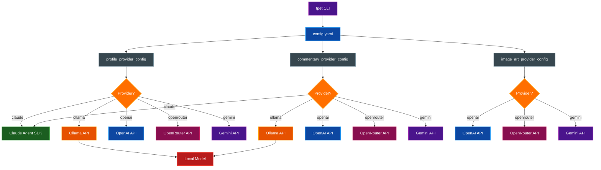
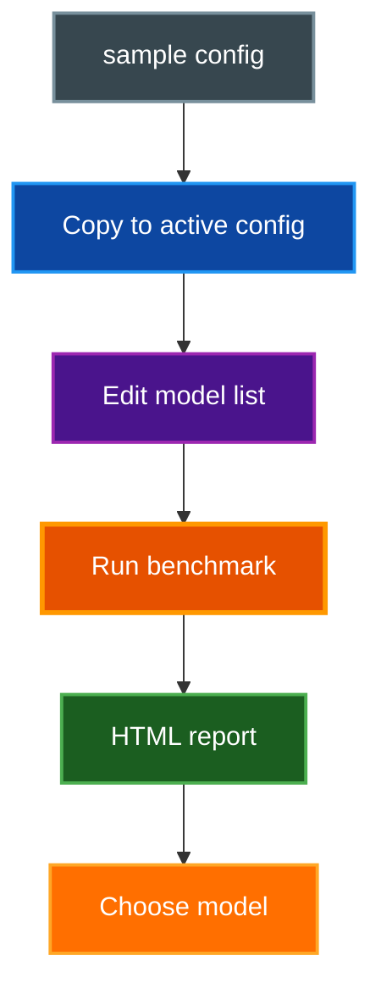

# Using term-pet with Ollama

Guide for running term-pet with local LLMs via Ollama instead of the default Claude Agent SDK, and benchmarking models for commentary and ASCII art quality.

## Table of Contents

- [Overview](#overview)
- [Prerequisites](#prerequisites)
- [Configuring tpet for Ollama](#configuring-tpet-for-ollama)
- [Model Selection](#model-selection)
- [Benchmark Scripts](#benchmark-scripts)
  - [Commentary Test](#commentary-test)
  - [ASCII Art Test](#ascii-art-test)
- [Test Configuration](#test-configuration)
- [Understanding Test Results](#understanding-test-results)
- [Troubleshooting](#troubleshooting)
- [Related Documentation](#related-documentation)

## Overview

term-pet supports five LLM providers, each selectable independently per pipeline:

- **Claude** (default) -- Uses the Claude Agent SDK with no API key required
- **Ollama** -- Uses any local model served by Ollama via its OpenAI-compatible API
- **OpenAI** -- Uses OpenAI's API for text or image generation
- **OpenRouter** -- Routes through OpenRouter to access multiple model providers
- **Gemini** -- Uses Google Gemini via the genai SDK

Each pipeline (profile generation, commentary, image art) has its own independent provider configuration via `PipelineProviderConfig`. Ollama works for the **text** pipelines (profile generation and commentary) but **cannot** generate images -- the image art pipeline requires `openai`, `openrouter`, or `gemini`.

Switching to Ollama lets you run term-pet completely offline with your choice of local model. Model quality varies significantly -- use the included benchmark scripts to find the best model for your hardware.



## Prerequisites

- Ollama installed and running (`ollama serve`)
- At least one model pulled (`ollama pull <model>`)
- Python dependencies installed (`uv sync`)
- For benchmark scripts: `openai` and `httpx` packages (included in dev dependencies)

## Configuring tpet for Ollama

Each pipeline has its own `PipelineProviderConfig` with `provider`, `model`, `base_url`, and `api_key_env` fields. Set the provider and model in your tpet config file (`$XDG_CONFIG_HOME/tpet/config.yaml`):

```yaml
# Use Ollama for commentary
commentary_provider_config:
  provider: ollama
  model: "mistral-small:latest"
  base_url: "http://localhost:11434/v1"

# Use Ollama for profile generation (optional)
profile_provider_config:
  provider: ollama
  model: "mistral-small:latest"

# Image art requires openai, openrouter, or gemini (Ollama cannot generate images)
# image_art_provider_config:
#   provider: openai
#   model: "gpt-image-1.5"
```

When `provider` is set to `ollama`, the `base_url` defaults to `http://localhost:11434/v1` and `api_key_env` is not required. The default model is `llama3.2` if no model is specified. You only need to specify fields you want to override.

Or use the CLI flags:

```bash
# Use Ollama for commentary
tpet run --commentary-provider ollama --commentary-model mistral-small:latest

# Use Ollama for profile generation
tpet new --profile-provider ollama --profile-model mistral-small:latest

# Image art requires an image-capable provider
tpet art --art-provider openai --art-model gpt-image-1.5
```

The commentary and profile pipelines use the `generate_text_openai_compat()` function in `src/tpet/llm_client.py`, which creates an OpenAI-compatible client for Ollama, OpenAI, and OpenRouter. The Claude provider uses the Agent SDK directly, and Gemini uses the Google genai SDK.

## Model Selection

### Recommended Models

Based on benchmark testing, the following models produce the best results:

| Use Case | Model | Size | Quality | Speed |
|----------|-------|------|---------|-------|
| **Best overall** | `mistral-small:latest` | ~13 GB | Excellent | Moderate |
| **Runner-up** | `phi4:latest` | ~8 GB | Good | Fast |
| **Best quality** | `llama3.3:latest` | ~40 GB | Excellent | Slow |
| **Low VRAM** | `gemma2:9b` | ~5 GB | Acceptable | Fast |

### Models to Avoid

These models produce poor ASCII art or inconsistent results:

- `llama3.2:1b` / `llama3.2:3b` -- Produce tiny 3-line art, ignore prompt subjects
- `gemma3:latest` -- Echoes frame labels instead of drawing, identical output across prompts
- `codellama:latest` -- Outputs text/emojis instead of ASCII art
- `qwen3:32b` -- Wastes all tokens on `<think/>` reasoning blocks (use `/no_think` or avoid)

> **Tip:** Larger models generally produce better results. If you have the VRAM, prefer 14B+ parameter models. Quantization (Q4_K_M or higher) degrades ASCII art quality noticeably.

## Benchmark Scripts

term-pet includes two benchmark scripts for evaluating Ollama models before committing to one.



### Commentary Test

Tests how well models generate in-character pet commentary for coding session events.

```bash
# Copy sample config and customize
cp scripts/ollama_test_config-sample.yaml scripts/ollama_test_config.yaml
# Edit scripts/ollama_test_config.yaml to set your models

# Run the test
uv run scripts/test_ollama_commentary.py

# Options
uv run scripts/test_ollama_commentary.py --config scripts/my_config.yaml
uv run scripts/test_ollama_commentary.py --output my_report.html
uv run scripts/test_ollama_commentary.py --fresh    # discard saved results
```

The script tests each model against multiple scenarios (developer questions, code fixes, idle chatter) and scores output quality against the pet's personality.

### ASCII Art Test

Tests how well models generate 6-frame ASCII art sprite sheets for small creatures.

```bash
# Copy sample config and customize
cp scripts/ollama_art_test_config-sample.yaml scripts/ollama_art_test_config.yaml
# Edit scripts/ollama_art_test_config.yaml to set your models

# Run the test
uv run scripts/test_ollama_art.py

# Options
uv run scripts/test_ollama_art.py --config scripts/my_art_config.yaml
uv run scripts/test_ollama_art.py --output my_art_report.html
uv run scripts/test_ollama_art.py --fresh       # discard saved results
uv run scripts/test_ollama_art.py --report-only  # regenerate HTML from saved JSON
```

Both scripts support **resume** -- if interrupted, re-running continues from the last completed model. Use `--fresh` to start over.

## Test Configuration

### Commentary Config (`ollama_test_config-sample.yaml`)

```yaml
ollama_base_url: "http://localhost:11434/v1"
temperatures: [0.25, 0.5, 0.75]
max_tokens: 256

# Pet profile for system prompt construction
pet:
  name: "Syntaxon"
  creature_type: "philosophical debugging sprite"
  personality: "A small, sardonic debugger..."
  backstory: "Born from a forgotten grep command..."
  stats:
    HUMOR: 45
    PATIENCE: 35
    CHAOS: 60
    WISDOM: 50
    SNARK: 60

# Test scenarios (developer events + idle chatter)
scenarios:
  - name: "Developer asks to fix auth bug"
    type: event
    role: user
    summary: "Fix the authentication middleware..."
```

### Art Config (`ollama_art_test_config-sample.yaml`)

```yaml
ollama_base_url: "http://localhost:11434/v1"
temperatures: [0.5]
max_tokens: 768

# Frame dimension validation
expected_frames: 6
min_lines_per_frame: 4
max_lines_per_frame: 12
min_line_width: 8
max_line_width: 24

# Creature prompts to test
prompts:
  - name: "Cat"
    prompt: "Draw a cute cat sitting down..."
  - name: "Robot"
    prompt: "Draw a small friendly robot..."

# Models to test
models:
  - mistral-small:latest
```

### Key Configuration Options

| Option | Commentary | Art | Description |
|--------|-----------|-----|-------------|
| `ollama_base_url` | Yes | Yes | Ollama API endpoint (default: `http://localhost:11434/v1`) |
| `temperatures` | Yes | Yes | List of temperatures to test per model |
| `samples_per_combo` | Yes | Yes | Number of generations per model/temp/prompt combination |
| `max_tokens` | 256 | 768 | Maximum tokens per response (art needs more) |
| `models` | Yes | Yes | List of Ollama model tags to test |

## Understanding Test Results

### HTML Reports

Both scripts generate dark-mode HTML reports with per-model breakdowns:

- **Pass/Fail badges** -- Green (PASS) or red (FAIL) based on validation
- **Frame art display** -- Art test shows all 6 frames in a grid
- **Raw response** -- Shown when frame parsing fails
- **Performance metrics** -- Latency (ms), tokens/second, token usage
- **Validation details** -- Frame count, line widths, dimension consistency

### Validation Criteria

The art test validates:

- Exactly 6 frames detected
- Consistent line count across all frames
- Consistent line width within each frame
- Dimensions within configured min/max ranges
- No code fence artifacts in output

### Resume Support

Results are saved incrementally to JSON files (`ollama_results.json`, `ollama_art_results.json`). If a test is interrupted:

- Re-run the same command to continue from the last completed model
- Use `--fresh` to discard saved results and start over
- Use `--report-only` to regenerate the HTML report without re-running tests

## Troubleshooting

### Model Not Found

```bash
# List available models
ollama list

# Pull a model before testing
ollama pull mistral-small:latest
```

### Ollama Image Art Not Supported

Ollama cannot generate images. If `image_art_provider_config.provider` is set to `ollama`, the `tpet art` command raises an error:

```
Error: Ollama does not support image generation.
Set image_art_provider_config.provider to 'openai', 'openrouter', or 'gemini'.
```

Use `openai`, `openrouter`, or `gemini` for the image art pipeline. Ollama works only for text pipelines (profile generation and commentary).

### Connection Refused

```bash
# Check Ollama is running
curl http://localhost:11434/api/tags

# Start Ollama if not running
ollama serve
```

### Reasoning Models Return Empty Content

Models like `qwen3` and `deepseek-r1` use `<think/>` reasoning blocks that consume tokens without producing visible output. The art test script automatically appends `/no_think` for known reasoning models. If a model still returns empty responses, try a different model or increase `max_tokens`.

### Art Frames All Look the Same

Some small models (under 7B parameters) default to drawing cats regardless of the prompt. The system prompt includes instructions to draw the specific creature, but models under ~8B often lack the instruction-following capability. Use a larger model.

### Frame Parsing Failures

The art parser handles several output formats:

- Frames separated by `---` lines
- Frames separated by ` ``` ` code fences
- Numbered frames (`Frame 0:`, `Frame 1:`, etc.)
- Frames wrapped in code fences

If parsing fails, the raw response is shown in the report. Check if the model is producing an unexpected format.

## Related Documentation

- [ARCHITECTURE.md](ARCHITECTURE.md) -- System architecture and module dependencies
- [CLAUDE.md](../CLAUDE.md) -- Code conventions and development commands
- [Ollama Documentation](https://github.com/ollama/ollama) -- Ollama setup and model management
